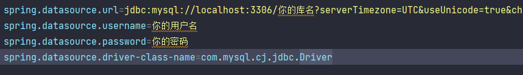

### 学生宿舍管理系统

#### 1、课设项目介绍

该系统拥有三种角色：

:older_man:系统管理员：

* 查看当前宿舍学生人数、住宿人数、报修数量、空舍数量、查看学生信息、宿管信息、查看楼宇信息、查看公告信息、查看房间信息、查看报修信息、查看调寝信息、访客管理、查看所有用户信息。

:woman:宿舍管理员：

* 查看当前宿舍学生人数、住宿人数、报修数量、空舍数量、查看学生信息、查看楼宇信息、查看公告信息、查看房间信息、查看报修信息、查看调寝信息、访客管理、查看个人信息。

:baby:学生：

* 查看当前宿舍学生人数、住宿人数、报修数量、空舍数量、查看我的宿舍、申请调宿、申请报修、查看个人信息。

#### 2、开发工具

​	后端：IDEA   
​	前端：VS Code 或 WebStorm

#### 3、项目技术

​	后端框架：Springboot、MyBatis、Mybatis Plus
​	前端技术：ElementUI、vue、css、JavaScript、axios

#### 4、环境：

JDK>=1.8、Maven、Node.js >=16、MySQL >=8.0

#### 5、硬件环境：

Windows 或者 Mac OS(不挑剔)

### 配置

0. 在 doc 中找到 `dormitory.sql`，执行，初始化数据库

1. 后端文件夹 `Dormitory_backend` ：

	修改 `application.properties` 文件

	

	将端口号和数据库地址、账号、密码改为自己的

	启动 `SpringbootApplication `

3. 前端文件夹 `Dormitory_frontend` ：

	进入文件夹目录后打开控制台cmd

	输入 `npm install` 安装前端环境，而后 `npm run serve` 启动前端

4. 用户名或密码在数据库中，查看三种用户的三个表

